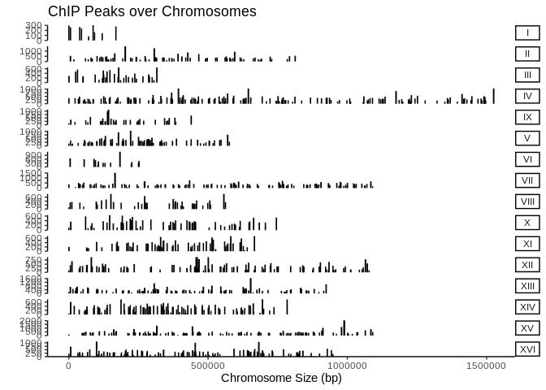
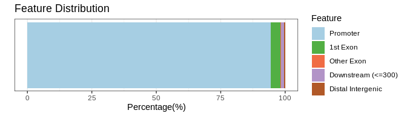
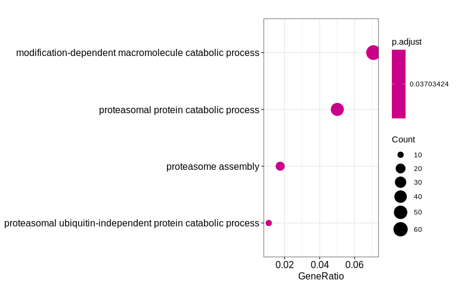

``` r
library("tidyverse")
library("rtracklayer")
library("ChIPseeker")
library("GenomicFeatures")
library("clusterProfiler")
library("org.Sc.sgd.db")
```

### Prepare Genome Annotation

Use the GenomicFeatures library to load the GTF file as a TxDb object.
This will be used for annotation of genomic ranges later.

``` r
anno <- makeTxDbFromGFF("genome/annotation.gtf")
```

    ## TxDb object:
    ## # Db type: TxDb
    ## # Supporting package: GenomicFeatures
    ## # Data source: genome/annotation.gtf
    ## # Organism: NA
    ## # Taxonomy ID: NA
    ## # miRBase build ID: NA
    ## # Genome: NA
    ## # Nb of transcripts: 7127
    ## # Db created by: GenomicFeatures package from Bioconductor
    ## # Creation time: 2020-11-06 13:40:23 -0500 (Fri, 06 Nov 2020)
    ## # GenomicFeatures version at creation time: 1.42.0
    ## # RSQLite version at creation time: 2.2.1
    ## # DBSCHEMAVERSION: 1.2

### Prepare Peaks

The peak ranges are contained within the narrowPeaks file from MACS2.
This is a BED file with some extra columns that can be loaded with the
rtracklayer library into a GRanges object.

``` r
peaks <- import(
  "results/peaks/Reb1_30s_peaks.narrowPeak",
  format="BED",
  extraCols=c(
    signal="numeric", neg_log10_pval="numeric",
    neg_log10_qval="numeric", peak="numeric"
  )
)
```

    ## GRanges object with 1107 ranges and 6 metadata columns:
    ##          seqnames        ranges strand |               name     score    signal
    ##             <Rle>     <IRanges>  <Rle> |        <character> <numeric> <numeric>
    ##      [1]        I         5-758      * |    Reb1_30s_peak_1      6535  22.99300
    ##      [2]        I     6027-6496      * |    Reb1_30s_peak_2       146   4.47760
    ##      [3]        I   38732-39167      * |    Reb1_30s_peak_3       541   8.26483
    ##      [4]        I   45290-45721      * |    Reb1_30s_peak_4       329   6.87259
    ##      [5]        I   70985-71518      * |    Reb1_30s_peak_5       568   9.47584
    ##      ...      ...           ...    ... .                ...       ...       ...
    ##   [1103]      XVI 870108-870562      * | Reb1_30s_peak_1103       905  12.70390
    ##   [1104]      XVI 899761-900591      * | Reb1_30s_peak_1104      1825  18.49400
    ##   [1105]      XVI 927713-928326      * | Reb1_30s_peak_1105        60   3.01977
    ##   [1106]      XVI 942367-942947      * | Reb1_30s_peak_1106      1096   9.34766
    ##   [1107]      XVI 947758-948000      * | Reb1_30s_peak_1107        73   2.42905
    ##          neg_log10_pval neg_log10_qval      peak
    ##               <numeric>      <numeric> <numeric>
    ##      [1]       656.8220       653.5780       285
    ##      [2]        16.2329        14.6971       248
    ##      [3]        56.0662        54.1462       256
    ##      [4]        34.7246        32.9701       227
    ##      [5]        58.7700        56.8329        70
    ##      ...            ...            ...       ...
    ##   [1103]       92.66990       90.53110       235
    ##   [1104]      185.04100      182.56200       186
    ##   [1105]        7.43291        6.05377       534
    ##   [1106]      111.88200      109.65100       424
    ##   [1107]        8.71850        7.31297       160
    ##   -------
    ##   seqinfo: 16 sequences from an unspecified genome; no seqlengths

### Coverage Plot

Plot peak strength over chromosomes.

``` r
covplot(peaks, weightCol="peak")
```

<!-- -->

### Peak Annotation

Annotate peaks to the closest gene.

``` r
peak_anno <- annotatePeak(peaks, tssRegion=c(-500, 250), TxDb=anno)
```

    ## >> preparing features information...      2020-11-06 01:40:26 PM 
    ## >> identifying nearest features...        2020-11-06 01:40:26 PM 
    ## >> calculating distance from peak to TSS...   2020-11-06 01:40:27 PM 
    ## >> assigning genomic annotation...        2020-11-06 01:40:27 PM 
    ## >> assigning chromosome lengths           2020-11-06 01:40:28 PM 
    ## >> done...                    2020-11-06 01:40:28 PM

    ## Annotated peaks generated by ChIPseeker
    ## 1107/1107  peaks were annotated
    ## Genomic Annotation Summary:
    ##              Feature  Frequency
    ## 5           Promoter 94.4896116
    ## 1           1st Exon  3.6133695
    ## 4         Other Exon  0.1806685
    ## 3 Downstream (<=300)  1.1743451
    ## 2  Distal Intergenic  0.5420054

### Peak Genomic Distribution Plot

``` r
plotAnnoBar(peak_anno)
```

<!-- -->

### Pathway Analysis

Get genes with a peak.

``` r
peak_genes <- seq2gene(
  peaks, tssRegion=c(-500, 250),
  flankDistance=500, TxDb=anno
)
```

    ## [1] "YAL069W_mRNA/YAL069W" "YAL058W_mRNA/YAL058W" "YAL030W_mRNA/YAL030W"
    ## [4] "YBL109W_mRNA/YBL109W" "YBL104C_mRNA/YBL104C" "YBL087C_mRNA/YBL087C"

Enrichment analysis using the Reactome Databse.

``` r
ont <- enrichGO(
  peak_genes, OrgDb=org.Sc.sgd.db, ont="BP",
  keyType="ENSEMBL"
)
```

    ## # A tibble: 4 x 9
    ##   ID     Description   GeneRatio BgRatio  pvalue p.adjust qvalue geneID    Count
    ##   <chr>  <chr>         <chr>     <chr>     <dbl>    <dbl>  <dbl> <chr>     <int>
    ## 1 GO:00… proteasome a… 16/918    35/5802 2.79e-5   0.0370 0.0357 YBR127C/…    16
    ## 2 GO:00… proteasomal … 10/918    17/5802 6.28e-5   0.0370 0.0357 YBL041W/…    10
    ## 3 GO:00… proteasomal … 46/918    168/58… 7.56e-5   0.0370 0.0357 YBL058W/…    46
    ## 4 GO:00… modification… 65/918    262/58… 7.89e-5   0.0370 0.0357 YBL058W/…    65

Enrichment dot-plot.

``` r
dotplot(ont)
```

<!-- -->
